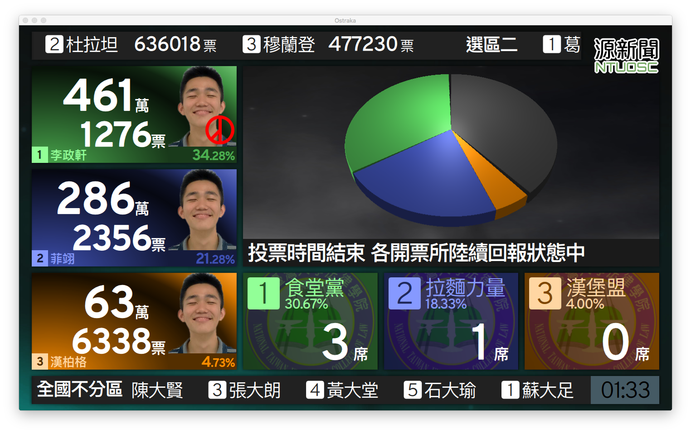
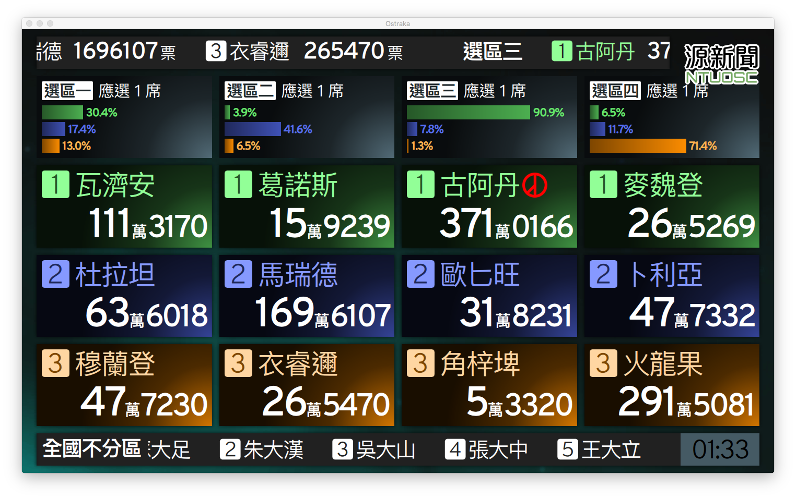
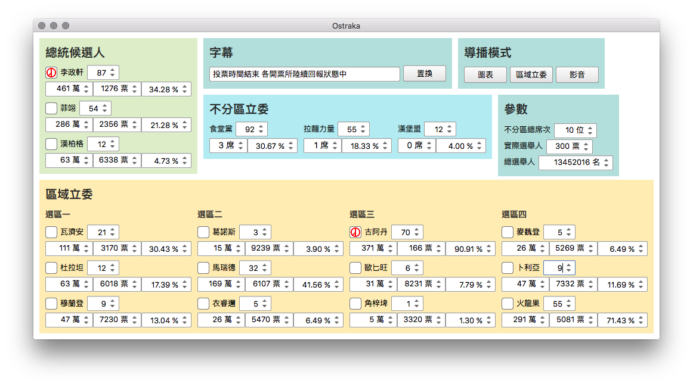

Ostraka
=======

這是為 2015 / 2016 臺大政治營設計的互動式即時計票系統，介面發想自壹電視 2016 總統大選開票實況。

Interactive live ballot counting system, for 2015 / 2016 NTU Political Camp. UI inspired by NextTV during 2016 presidential election.

Prerequisites / 系統需求
-------------

* Qt 5.5 with QtCanvas3D support
* QML port of [Three.js](https://github.com/tronlec/three.js) (included as submodule)
* Set up [`ostraka.txt`](ostraka.example.txt) within the same folder of app.
* Note: Built and tested under OS X 10.11, some fonts might not be available on different OSes or versions.

Screenshots / 螢幕截圖
-----------

### Presidential Election / 總統大選

投影主畫面，可切換為區域立委選舉、或使用視訊鏡頭即時播報。

Main screen of the application. Local legislative seats and live broadcasting are available as alternative views.

### Local Legislative Election / 區域立法委員選舉

### Control Pane / 控制界面

當使用雙螢幕投影時，會自動出現在筆記型電腦螢幕上；變動會即時反映至投影螢幕。

Shows on the laptop side with a dual display installation; changes would reflect to the main screen on-the-fly.

License / 授權
-------

此軟體以 [GNU GPLv3](LICENSE.md) 授權釋出。任何人都可以自由的使用、修改此軟體，惟須同樣以自由軟體形式散布其與其原始碼；詳細資訊請參閱隨附[授權](LICENSE.md)。

Released under [GPLv3](LICENSE.md). Anyone could freely use or modify this software, provided that it is distributed as free software with its source code. Refer to [LICENSE](LICENSE.md) for precise terms.

---

[Ostraka](https://github.com/rschiang/ostraka) authored by Poren Chiang.

Three.js and the QML Three.js fork are under the [MIT License](qml/three/LICENSE.md).

Overpass font is released under [SIL Open Font License](assets/fonts/LICENSE.md).
